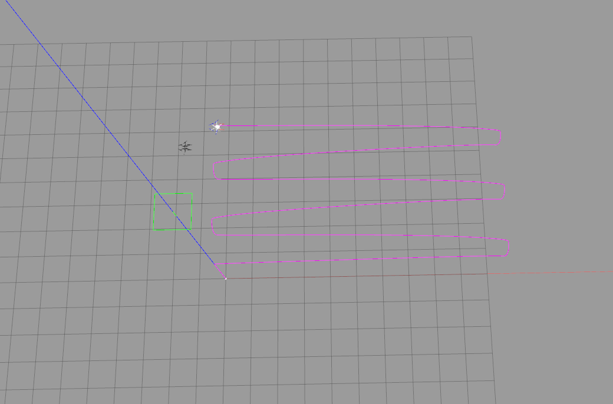

This is a repository which can draw the model's trajectory in Gazebo.

The launch file and urdf are just examples for better understanding, please add the code to your own files according to the notes in my files.

Remenber to add the corresponding configuration in you CmakeLists.txt to ensure that the plugin can be generated.

### Acknowledgement

[UnitreeRobotics](https://github.com/fan-ziqi/unitree_ros/tree/dcd18f828a736187573b51d01560a1935985ceb5)
